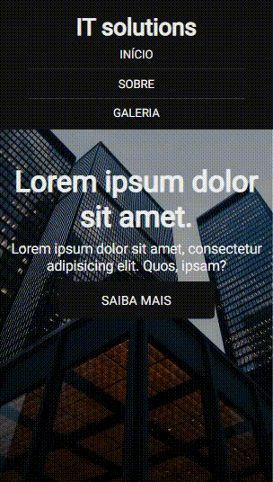

<h1 align="center">IT SOLUTIONS</h1>

    A project to practice <strong>responsiveness</strong>

    
    
    

    <a href="#about">About</a> •
    <a href="#View">View</a> •
    <a href="Author">Author</a>

## About

    A project created by this youtube video: <a href="https://www.youtube.com/watch?v=G4_QjTJTVlc&list=WL&index=12&t=3s">"Fazendo um site TOTALMENTE RESPONSIVO e Mobile-Friendly - HTML & CSS"</a>
    With the aim of studying <strong>responsiveness</strong> in practice.

## View

    
    

## Author

    
    

        <strong>Gustavo Silva</strong>
    

    

        Web developer, currently at the American School of Recife, A film lover.
    

    

        
        
    

